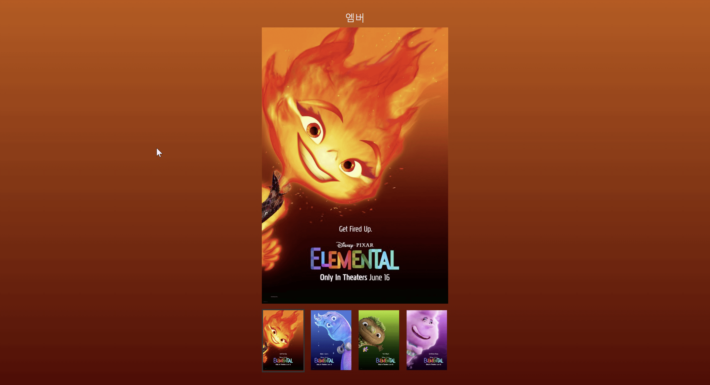

mission02 과제 요구사항

```
이벤트 처리 방식을 사용하여 클릭 이벤트를 걸어주세요.
  
  이벤트 위임을 사용
  반복문을 사용
  함수를 분리
  가독성이 좋은 코드로 리팩토링
  
  이미지와 색상의 데이터는 `data.js` 에서 불러올 것
  
  각 li 항목들을 클릭하면 
    배경 색상과 메인 비주얼 이미지를 변경
  
  배경색 변경

  비주얼이 변경되면 상단의 이름을 연동해서 변경
```


유틸함수와 데이터를 모듈화
```js
import { getNode, bindEvent } from "./../lib/index.js";
import { data } from "./data.js";
```


main.js의 전역변수
```
변수명에 붙은 1은 예약어가 아님을 나타냄
```
```js
let title1 = getNode(".nickName");
const poster1 = getNode(".visual img");
const nav1 = getNode(".nav");
```


bindEvent함수와 그것의 콜백함수
```js
function changeCharacterTheme(e) {
  let target = e.target;

  if (target.tagName === "IMG") {
    setNameText(target);
    setNameImage(target);
    setBgColor(target);
  }
}

bindEvent(nav1, "click", changeCharacterTheme);
```


setNameText함수
```
페이지 상단의 캐릭터 이름을 변경함

함수 changeCharacterTheme의 지역변수인 target을 알규먼트로 사용함

indexOf(' ')와 slice 메소드를 사용하여, 
target.alt에서 캐릭터 이름을 추출함
```
```js
function setNameText(target) {
  let name1Text = `${target.alt}`;
  let name1Text__cut = `${target.alt}`.indexOf(" ");
  let name1 = name1Text.slice(0, name1Text__cut);

  title1.textContent = name1;
}
```

setNameImage
```
target의 src값을 poster1의 src에 할당시킴으로서,
포스터 이미지를 변경함
```
```js
function setNameImage(target) {
  poster1.src = target.src;
}
```

setBgColor
```
switch문을 이용하여 data.js의 배열에 사용할 인덱스 번호를 할당하고,
data.js의 data배열에 접근하여 colorA, colorB에 값을 할당함

backGround1.style.background = `linear-gradient(to bottom, ${colorA},${colorB})`; 를 사용하여, 
body의 background 색상을 변경함
```
```js
function setBgColor(target) {
  let chosenCharacter = 0;
  let switcherCharacter = `${target.alt}`;
  let backGround1 = getNode("body");

  switch (true) {
    case switcherCharacter === "엠버 포스터":
      chosenCharacter = 0;
      break;
    case switcherCharacter === "웨이드 포스터":
      chosenCharacter = 1;
      break;
    case switcherCharacter === "클로드 포스터":
      chosenCharacter = 2;
      break;
    case switcherCharacter === "게일 포스터":
      chosenCharacter = 3;
      break;
  }

  let colorA = data[chosenCharacter].color[0];
  let colorB = data[chosenCharacter].color[1];
  backGround1.style.background = `linear-gradient(to bottom, ${colorA},${colorB})`;
}
```


